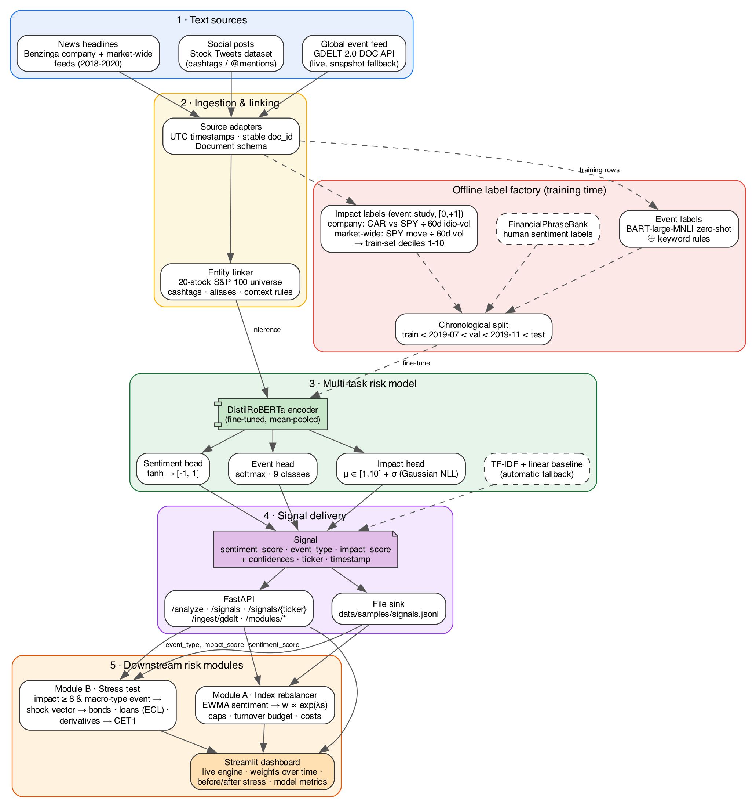
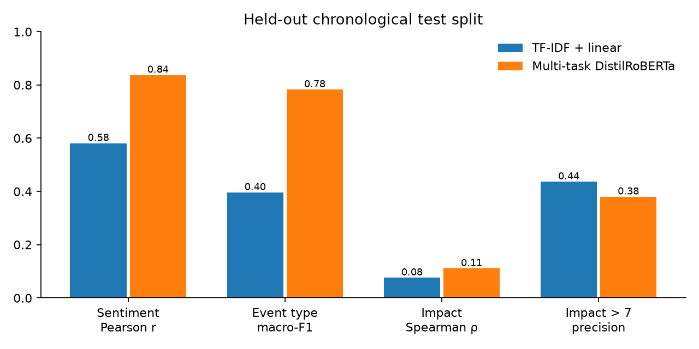
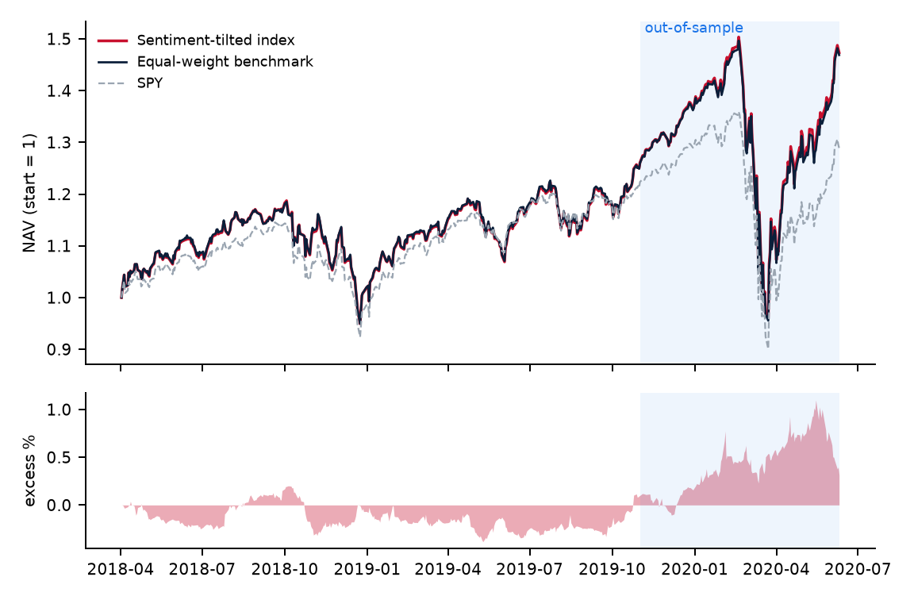
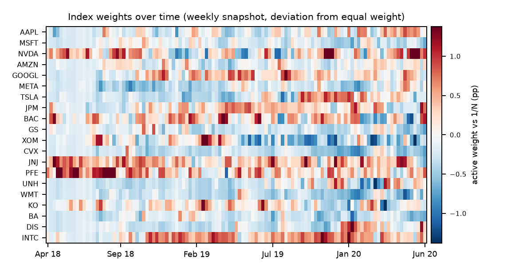
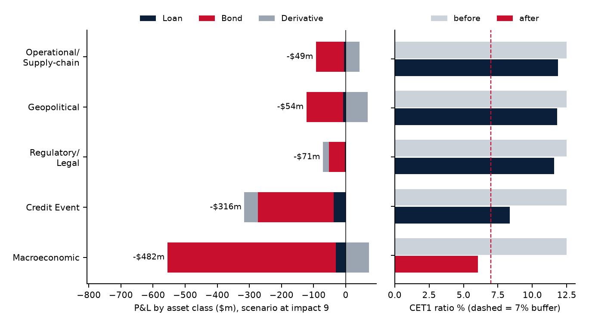

# AI/NLP Financial Risk Engine — S&P Global × Crisil Campus Hackathon 2026

[](https://github.com/agr-arsh-15/manipal-arsh-agrawal-hackathon/actions/workflows/ci.yml)
Tested on Windows, macOS and Ubuntu (Python 3.11) on every push.

**Candidate Name:** Arsh Agrawal  
**College Email ID:** ARSH.23FE10CDS00069@muj.manipal.edu  
**College / Campus:** Manipal University Jaipur  
**Live Dashboard:** [manipal-arsh-agrawal-hackathon.streamlit.app](https://manipal-arsh-agrawal-hackathon.streamlit.app/) (public, no login; the first load after a quiet period can take about a minute while the app wakes up)  
**Demo Video Link:** _to be added — unlisted YouTube link (script in [`docs/demo_script.md`](docs/demo_script.md))_  
**Slide Deck Link:** [docs/presentation.pdf](https://github.com/agr-arsh-15/manipal-arsh-agrawal-hackathon/blob/main/docs/presentation.pdf) 

### Evaluate it in 60 seconds

Open the [live dashboard](https://manipal-arsh-agrawal-hackathon.streamlit.app/), then:

1. **Risk Engine:** click **Score headlines**. Six curated headlines are scored. Microsoft and Intel
   are tagged as earnings news with opposite sentiment, the Ford downgrade as a Credit Event, the
   factory fire as Operational/Supply-chain, and Disney–Fox as M&A, each linked to its ticker.
   Replace them with any headline of your own.
2. **Module A · Index Rebalancer:** read the out-of-sample metrics next to the "Honest read" note,
   then move the tilt-strength slider. A warning makes clear the out-of-sample figures are then no
   longer clean. **Reset to selected parameters** restores the in-sample choice.
3. **Module B · Stress Testing:** the default macro headline has already passed all four trigger
   gates and revalued the synthetic book (P&L waterfall, IFRS 9 staging, CET1 vs the 7% line).
   Enter an earnings headline to see which gate fails, or tick the what-if box to force a run.
4. **Model Performance:** a model card listing where the model is strong, where it is weak and what
   it is appropriate for, with every metric compared against the TF-IDF baseline.

---

## 1. Project Overview — Problem Statement & Approach

Market-moving information arrives first as unstructured text: an analyst downgrade, a sanctions
headline, a CEO's tweet. It reaches prices, spreads and ratings later. This project builds an
**AI/NLP risk engine** that reads that text from multiple sources and turns every item into three
quantified, auditable signals:

| Field | Range | Meaning |
|---|---|---|
| `sentiment_score` | [-1, 1] | Tone of the text towards the linked company (or the market) |
| `event_type` | 9 classes | Geopolitical · Macroeconomic · Credit Event · Merger/Acquisition · Product Launch · Regulatory/Legal · Earnings/Guidance · Operational/Supply-chain · Other/None |
| `impact_score` | 1–10 | Expected severity of the market reaction, **calibrated to realised returns** (see below) |

Each signal also carries `event_confidence`, `impact_confidence` (from a predicted variance),
ticker, timestamp, source and model version. Signals are served by a **FastAPI** service and
written to a **JSONL file**. Two downstream risk modules consume them, and both are implemented:

- **Module A — Sentiment-driven index rebalancing.** A 20-stock S&P 100 index tilts towards
  improving impact-weighted sentiment. Weights are bounded, turnover is capped and costs are
  charged, and weights-over-time are shown on the dashboard.
- **Module B — Event-driven stress testing.** A high-impact systemic event (impact ≥ 8 with a
  Geopolitical, Macroeconomic, Credit Event, Operational or Regulatory type, adverse sentiment and
  a confident event classification) triggers a shock vector.
  The shock revalues a synthetic wholesale banking book of loans, bonds and derivatives and reports
  P&L, IFRS 9 ECL, Stage 2 migration and CET1 before and after.

**Design choices that matter to a risk user**

- **Impact is measured, not guessed.** Labels come from an event study over the [0, +1] session
  window:
  - **Company news:** the cumulative abnormal return against an SPY market model, divided by the
    stock's 60-day idiosyncratic volatility.
  - **Market-wide news:** the SPY move divided by SPY's own 60-day volatility. A market model would
    net a systemic shock out of the label.
  - Both are binned into train-set deciles, so an impact of 9 means a top-decile surprise.
- **No look-ahead.**
  - The train/validation/test split is chronological (train before 2019-07, validation before
    2019-11, test after that, which includes the COVID-19 crash).
  - Headlines published at or after 16:00 New York time roll to the next session.
  - Module A weights formed on day *t* only earn day *t+1* returns.
- **Honest labels.** Event classes come from a zero-shot NLI model (`facebook/bart-large-mnli`)
  reconciled with keyword rules. A 268-row hand-labelled set has been drawn as the independent
  check; its labelling is still in progress, so no human-label metric is reported yet.
- **Uncertainty is first-class.** The impact head predicts a mean and a variance, so every signal
  says how sure it is.

## 2. Architecture & Tech Stack



| Layer | Implementation |
|---|---|
| Ingestion | `src/ingestion/adapters.py` (PhraseBank, Benzinga, Stock Tweets) and `src/ingestion/gdelt.py`. GDELT uses the live DOC API, falls back to the raw 15-minute GKG exports, and falls back again to a snapshot. Everything is normalised to one `Document` schema (`src/schemas.py`). |
| Entity linking | `src/linking/matcher.py` maps cashtags, aliases and context rules to the 20-stock universe (`config/universe.yaml`). Ambiguous names such as Apple or Meta need financial context. Unlinked macro news becomes an event-level signal. |
| Label factory | `src/labeling/impact.py` (event study), `src/labeling/zeroshot.py` with `scripts/relabel_events_zeroshot.py` (BART-MNLI with rule reconciliation), and `scripts/build_unified_dataset.py`. |
| Model | `src/models/multitask.py` is a fine-tuned **DistilRoBERTa** encoder with mean pooling and three heads: a tanh sentiment regressor, a 9-way event softmax, and a heteroscedastic impact head (Gaussian NLL). The loss is masked per task and the event weights are class-balanced. `src/models/baselines.py` is a TF-IDF + linear baseline, used as the yardstick and as a fallback. |
| Engine & delivery | `src/engine/pipeline.py` (`RiskEngine`), `src/engine/store.py` (JSONL store) and `src/api/main.py` (FastAPI). |
| Modules | `src/modules/rebalancer.py` (Module A) and `src/modules/stress.py` with `config/stress_scenarios.yaml` (Module B). |
| Dashboard | `app/dashboard.py` (Streamlit and Plotly), with tabs for the live engine, Module A, Module B and model performance. |

**Tech stack:** Python 3.11, PyTorch 2.14 (Apple-silicon MPS, CUDA or CPU), Hugging Face
Transformers 5, scikit-learn, pandas 3, FastAPI and Pydantic v2, Streamlit and Plotly,
matplotlib and ReportLab for the deck, and pytest. Exact versions are pinned in `requirements.txt`.

**API**

| Method | Path | Purpose |
|---|---|---|
| GET | `/health` | Backend (`transformer` or `baseline`), model version and signal count |
| POST | `/analyze` | Score up to 256 texts (`{"items":[{"text": "...", "source_type": "news"}]}`); optionally persist them |
| GET | `/signals` | Query the stream (filters: `event_type`, `min_impact`, `since`, `limit`) |
| GET | `/signals/{ticker}` | Signals for one universe ticker |
| POST | `/ingest/gdelt` | Pull live GDELT headlines, score and persist them |
| POST | `/modules/stress-test` | Run Module B from a headline or from an `event_type` and `impact_score` |
| GET | `/modules/rebalancer/weights` | Latest Module A target weights |

## 3. Dataset Used

All data is public or synthetic. No S&P Global or Crisil proprietary data is used. Every CSV/JSON
the system consumes is in [`data/`](data). The raw Kaggle dumps (~1.1 GB) are gitignored, but
format-preserving 300-row extracts are committed in [`data/raw_samples/`](data/raw_samples).

| Source | Licence | Role | Rows used |
|---|---|---|---|
| [FinancialPhraseBank](https://www.kaggle.com/datasets/ankurzing/sentiment-analysis-for-financial-news) (Malo et al.) | CC BY-NC-SA 3.0 | Human sentiment labels (news sentences) | 4,846 |
| [Benzinga "Massive Stock News"](https://www.kaggle.com/datasets/miguelaenlle/massive-stock-news-analysis-db-for-nlpbacktests) (analyst-ratings and partner feeds) | Kaggle, research use | Company news (event + company impact) and market-wide news (market impact) | 13,000 company + 3,655 market-wide (training); ~24k in the signal stream |
| [Tweet Sentiment's Impact on Stock Returns](https://www.kaggle.com/datasets/thedevastator/tweet-sentiment-s-impact-on-stock-returns) | CC0 | Social posts (event + company impact) | 3,481 |
| [GDELT 2.0](https://www.gdeltproject.org/) DOC API and GKG raw exports | Open | Live global event feed (inference) — snapshot in `data/samples/gdelt_snapshot.json` | live |
| Yahoo Finance daily prices (20 stocks, SPY, ^VIX) | Public | Event-study labels and the Module A backtest — cached in `data/prices/` | 2018-2020 |
| Synthetic wholesale portfolio (`scripts/build_synthetic_portfolio.py`, seed 2026) | Synthetic | Module B book — `data/portfolio/synthetic_portfolio.csv` | 144 positions (60 loans, 45 bonds, 39 derivatives) |

**Key files**

- `data/samples/unified_risk_dataset.csv`: the labelled training table. It has task masks and a
  shared `split` column.
- `data/labels/event_labels_zeroshot.csv`: zero-shot event labels.
- `data/labels/hand_labelled_eval.csv`: the 268-row human evaluation set.
- `data/samples/signals.jsonl`: the full signal stream.
- `data/outputs/`: Module A weights, NAV and sentiment state, plus the Module B triggers.

**Assumptions and limitations of the data**

- Benzinga and Stock Tweets end in mid-2020. Tweets cover 2018 H2 only.
- Market-wide impact labels are day-level, so all market headlines published on the same day
  share one label.
- The PhraseBank licence is non-commercial, which is fine for this research prototype.
- The news data is public, published headlines. A handful mention listed companies such as
  rating agencies, as any financial newswire does. No client data, client names or engagement
  details from S&P Global or Crisil are used anywhere.
- The Module B book is fully synthetic. Counterparties are named `Borrower-001`, `Issuer-001` and
  `Dealer-001` and so on, and the balances, ratings and PDs are drawn from a seeded generator.

## 4. Quickstart & Installation

The same commands work on **Windows, macOS and Linux**. Every task runs through `run.py`, a small
standard-library script, so neither `make` nor a Unix shell is needed. CI runs the full install,
the test suite and an end-to-end smoke check on all three operating systems on every push.

### 4.1 Prerequisites

| | Windows 10/11 | macOS 12+ (Intel or Apple silicon) | Linux (Ubuntu 22.04+ or similar) |
|---|---|---|---|
| Python **3.11** (64-bit) | `winget install Python.Python.3.11` or the [python.org installer](https://www.python.org/downloads/release/python-3119/) (tick "Add python.exe to PATH") | `brew install python@3.11` or python.org | `sudo apt install python3.11 python3.11-venv` (or deadsnakes PPA / pyenv) |
| Git | `winget install Git.Git` | `xcode-select --install` | `sudo apt install git` |
| Disk / RAM | about 3 GB free, 8 GB RAM | same | same |
| GPU | not needed (CPU inference is about 12 ms per headline) | Apple-silicon GPU (MPS) used automatically | NVIDIA CUDA used automatically if present |

Python 3.11 is the tested version. All dependencies are pinned in `requirements.txt`.

### 4.2 Install and run

**Windows (PowerShell)**

```powershell
git clone https://github.com/agr-arsh-15/manipal-arsh-agrawal-hackathon.git
cd manipal-arsh-agrawal-hackathon
py -3.11 -m venv .venv
# If activation is blocked: Set-ExecutionPolicy -Scope Process -ExecutionPolicy Bypass
.venv\Scripts\Activate.ps1
python -m pip install --upgrade pip
python -m pip install -r requirements.txt
python run.py fetch-model        # downloads the fine-tuned transformer (309 MB, SHA256-verified)
python run.py smoke              # end-to-end check, about 1 minute
python run.py dashboard          # opens http://localhost:8501
```

If you use Command Prompt instead of PowerShell, activate with `.venv\Scripts\activate.bat`.

**macOS**

```bash
git clone https://github.com/agr-arsh-15/manipal-arsh-agrawal-hackathon.git
cd manipal-arsh-agrawal-hackathon
python3.11 -m venv .venv
source .venv/bin/activate
python -m pip install --upgrade pip
python -m pip install -r requirements.txt
python run.py fetch-model
python run.py smoke
python run.py dashboard
```

**Linux**

```bash
git clone https://github.com/agr-arsh-15/manipal-arsh-agrawal-hackathon.git
cd manipal-arsh-agrawal-hackathon
python3.11 -m venv .venv
source .venv/bin/activate
python -m pip install --upgrade pip
# Optional, without an NVIDIA GPU: install the CPU-only torch first, which saves about 2.5 GB.
python -m pip install torch==2.14.1 --index-url https://download.pytorch.org/whl/cpu
python -m pip install -r requirements.txt
python run.py fetch-model
python run.py smoke
python run.py dashboard
```

On macOS and Linux, `make setup`, `make smoke`, `make dashboard` and so on are shortcuts for the
same commands.

**The model weights.** The fine-tuned transformer is too large for git, so it is published as a
[GitHub Release asset](https://github.com/agr-arsh-15/manipal-arsh-agrawal-hackathon/releases/tag/v1.0.0).
`python run.py fetch-model` downloads it and checks its hash.

- If the download is blocked, download `risk_engine-v1.0.0.zip` from the Releases page in a
  browser, then run `python run.py fetch-model --url path\to\risk_engine-v1.0.0.zip`.
- Without the weights, every command still works: live scoring falls back to the committed TF-IDF
  baseline, and the dashboard says so.
- The precomputed signal stream, backtests and reports always come from the transformer.

### 4.3 What each command does

| Command | What it does | Time on a laptop CPU |
|---|---|---|
| `python run.py test` | Full pytest suite (64 tests; the 3 raw-adapter tests skip unless the Kaggle data is downloaded, and the pinned demo-output tests skip without the transformer) | about 15 s |
| `python run.py smoke` | Scores the 6 dashboard demo headlines (and, on the transformer, checks the default stress headline triggers), runs Module A and Module B, loads all reports, clicks through every dashboard tab and interaction path, and checks the Streamlit server | about 1 min |
| `python run.py dashboard` | Streamlit UI on http://localhost:8501 (engine, Module A, Module B and model-performance tabs) | starts in about 10 s |
| `python run.py api` | FastAPI on http://127.0.0.1:8000, with interactive docs at http://127.0.0.1:8000/docs | starts in about 10 s |
| `python run.py evaluate` | Baseline vs transformer report (`reports/engine_eval.*`) and figures | about 5 min |
| `python run.py signals` | Re-scores the full 27k-signal stream (`data/samples/signals.jsonl`) | about 10 min |
| `python run.py modules` | Synthetic book, Module A backtest, Module B scenarios (`reports/`, `data/outputs/`) | about 1 min |
| `python run.py deck` | Rebuilds `docs/presentation.pdf` (and `docs/architecture.png` if Graphviz is installed) | about 10 s |

Extra arguments are passed through, for example `python run.py dashboard --server.port 8600`.

**Calling the API** (start it first with `python run.py api` in another terminal):

```bash
# macOS / Linux
curl -s -X POST http://127.0.0.1:8000/analyze -H "content-type: application/json" \
  -d '{"items":[{"text":"Moody'\''s downgrades Boeing to junk as cash burn accelerates"}]}'
```

```powershell
# Windows PowerShell
$body = @{ items = @(@{ text = "Moody's downgrades Boeing to junk as cash burn accelerates" }) } | ConvertTo-Json -Depth 3
Invoke-RestMethod -Method Post -Uri http://127.0.0.1:8000/analyze -ContentType "application/json" -Body $body | ConvertTo-Json -Depth 5
```

The easiest option on any OS is the Swagger UI at http://127.0.0.1:8000/docs: open `POST /analyze`,
click "Try it out", and paste a headline.

### 4.4 Troubleshooting

| Symptom | Fix |
|---|---|
| `py` or `python3.11` not found | Install Python 3.11 (see 4.1). On Windows, reopen the terminal after installing so PATH updates. |
| `Activate.ps1 cannot be loaded because running scripts is disabled` | Run `Set-ExecutionPolicy -Scope Process -ExecutionPolicy Bypass` in the same PowerShell window, then activate again. |
| `[error] Missing packages` from `run.py` | The virtual environment is not active, or the install failed. Activate `.venv` and rerun `python -m pip install -r requirements.txt`. |
| Port 8501 or 8000 already in use | `python run.py dashboard --server.port 8600` or `python run.py api --port 8001`. |
| `fetch-model` fails behind a proxy or offline | Download the zip from the Releases page and pass `--url` with its local path. Everything also runs on the TF-IDF baseline without it. |
| The first run is slow | PyTorch and Transformers take 10-20 s to import the first time. Later runs are faster. |
| `python run.py deck` skips the architecture diagram | Graphviz is optional and only re-renders `docs/architecture.png`. The committed PNG is current. |
| Training is very slow on CPU | Training is not needed to run anything. Use `fetch-model`. |

### 4.5 Reproduce everything from scratch (optional)

These steps rebuild the labelled dataset and retrain the model. Judges do not need them, because
all outputs are committed.

1. Install the Kaggle client with `python -m pip install kaggle`. Put `KAGGLE_USERNAME` and
   `KAGGLE_KEY` in a `.env` file (see `.env.example`).
2. Download the raw data into `data/raw/` (about 1.1 GB):
   `python scripts/download_data.py` and `python scripts/download_benzinga.py`.
3. `python run.py data`: builds `data/samples/unified_risk_dataset.csv` with event-study impact
   labels.
4. `python run.py label`: zero-shot BART-MNLI event labels (about 1 hour on a GPU; downloads the
   model from the Hugging Face Hub on first use).
5. `python run.py train`: fine-tunes DistilRoBERTa (about 25 min on an Apple M3; much longer on
   CPU).
6. `python run.py evaluate`, then `python run.py signals`, `python run.py modules` and
   `python run.py deck`.

## 5. Key Results & Domain Impact

Every number below is produced by the scripts in this repository. The underlying files are
`reports/engine_eval.md`, `reports/module_a_backtest.json` and `reports/module_b_stress.json`.

**NLP engine on the held-out chronological test split** (Nov 2019 – Jun 2020, never seen in
training or model selection)

| Task | Metric | TF-IDF baseline | Multi-task DistilRoBERTa |
|---|---|---|---|
| Sentiment (n = 730) | Pearson r / MAE / 3-class macro-F1 | 0.58 / 0.38 / 0.62 | **0.84 / 0.17 / 0.83** |
| Event type (n = 2,839) | macro-F1 / accuracy | 0.40 / 0.80 | **0.78 / 0.90** |
| Impact, company news (n = 6,421) | Spearman ρ | 0.08 | **0.12** |
| Impact, all (n = 7,114) | recall / precision of "impact > 7" (base rate 0.30) | 0.09 / 0.44 | **0.32** / 0.38 |
| Latency | p50 per headline | 1 ms (CPU) | **9 ms (MPS), 12 ms (CPU)**; 900 headlines/s batched |



Notes on the engine results:

- The transformer's per-class event F1 is 0.57–0.97, including the rare systemic classes:
  Macroeconomic 0.69, Geopolitical 0.69, Credit Event 0.65.
- Predicted impact deciles are monotone in realised severity. The mean realised impact rises from
  about 5.2 in the lowest buckets to 6.5 in the top bucket
  (`docs/figures/impact_calibration.png`).
- **Caveat:** the market-wide impact label (one per day) does not yet generalise to the
  COVID-era test window (Spearman ρ ≈ 0). See Limitations.

**Module A: sentiment-tilted index vs equal weight**

- The configuration is selected on the in-sample window (before 2019-11-01) from a 24-point grid:
  λ = 1, half-life 5 days, impact-weighted sentiment.
- In-sample, the five best configurations all weighted each headline's sentiment by its
  predicted impact rather than plain averaging.
- Out of sample (2019-11-01 to 2020-06-10, through the COVID crash):
  - excess return +0.25%;
  - information ratio 0.30;
  - Sharpe 0.81 vs 0.80;
  - tracking error 1.1%;
  - daily hit rate 56%;
  - 1.5% average daily turnover;
  - sentiment IC 0.021 (t = 0.9).
- The edge is small and not statistically significant. It is reported as such.




**Module B: event-driven stress test** on the synthetic $9.1bn book, with reference scenarios at
impact 9:

| Scenario | P&L | Loans to Stage 2 | ECL | CET1 (from 12.5%) |
|---|---|---|---|---|
| Macroeconomic (rates +, spreads wider) | **−$482m (−5.3%)** | 5 | $23m → $54m | **6.1% — breaches the 7% buffer** |
| Credit Event (spread blow-out, PD ×) | −$316m (−3.5%) | 12 | $23m → $60m | 8.4% |
| Regulatory/Legal | −$71m | 0 | $23m → $26m | 11.6% |
| Geopolitical | −$54m | 0 | $23m → $31m | 11.8% |
| Operational/Supply-chain | −$49m | 0 | $23m → $28m | 11.9% |



- Pay-fixed swaps and CDS protection offset part of the losses, so the hedges show up in the
  waterfall.
- **Historical replay.** The 27,669-signal stream would have fired 162 stress tests (about 6 per
  month). Each one required impact ≥ 8, an adverse sentiment, event confidence ≥ 0.6, and counted
  once per event-day. Examples include "Dow Jones plunges further as Fed rate cut fails to boost
  confidence" (Mar 16 2020) and "Jobs report: −701K in March" (Apr 3 2020).

**Domain impact**

- **Time to impact.** Headline-to-capital-impact time falls from days of manual analysis to
  seconds. A severe adverse headline automatically yields a sized P&L, ECL and CET1 read-out.
- **Credit early warning.** Company-level sentiment and Credit Event signals flag SICR candidates
  before ratings move. The IFRS 9 staging effect is quantified immediately.
- **Capital planning.** The sector and asset-class waterfall shows where the buffer is consumed,
  which feeds hedging and limit decisions.
- **Audit trail.** Every signal carries its source, timestamp, model version, confidence and a
  text excerpt.

---

### Repository layout

```
run.py                      cross-platform task runner (python run.py <task>)
app/dashboard.py            Streamlit dashboard (4 tabs); fetches the model on first start
app/requirements.txt        slim CPU-only dependencies used by Streamlit Community Cloud
.streamlit/config.toml      dashboard server settings (file watcher off, headless)
config/                     engine, taxonomy, universe, impact bins, stress scenarios
data/                       prices, labels, samples (dataset, signals, GDELT snapshot), portfolio, outputs, raw_samples
docs/                       architecture.{dot,png}, presentation.pdf, figures/, demo_script.md
reports/                    engine_eval, module_a_backtest, module_b_stress, event_labels, training_history
scripts/                    dataset build, labelling, training, evaluation, signal generation, modules,
                            deck, model packaging / download, smoke check
src/                        ingestion, linking, labeling, models, engine, api, modules, eval,
                            dashboard_logic (testable presentation logic for the dashboard)
tests/                      pytest suite (adapters, impact, GDELT, pipeline, API, modules, eval, dashboard)
.github/workflows/ci.yml    install + tests + smoke on Windows, macOS and Ubuntu
```

**Repository hygiene.** The raw Kaggle dumps (about 1.1 GB) and the 309 MB model checkpoint are
not committed. The checkpoint is a release asset, and the raw data has download scripts plus
300-row format samples. The largest committed file is the 15 MB signal stream.
